# learn-gas-by-action-rpg-game

## 目录

[1. Action RPG Game的设定和玩法](#1-action-rpg游戏的设定和玩法)

[2. 玩家的装备槽与库存系统](#2-玩家的装备槽与库存系统)

[3. 使用GAS](#3-使用gas)

[4. 与GAS交互](#4-与gas交互)

[5. 为GE准备Target](#5-为ge准备target)

[6. 实现一个Ability Task](#) (TODO)

[7. 初始技能与被动效果](#7-初始技能与被动效果)

[8. 技能激活、蓝耗与冷却](#8-技能激活蓝耗与冷却)

[9. 调试](#9-调试)

[10. Unreal Input Systme(Legacy vs Enhanced)](#10-unreal-input-systmelegacy-vs-enhanced) (TODO)

[11. Action RPG Game中角色的控制方案](#11-action-rpg-game中角色的控制方案)

[12. UE中的Delegates](#12-ue中的delegates)

[13. UE中的射线检测](#13-ue中的射线检测) (TODO)

[14. Action RPG Game中的AI](#14-action-rpg-game中的ai)

## 启用GAS

UE中的GAS是以插件的形式发布的，所以我们首先需要启用这个插件
- 进入`Edit->Plugins`搜索`Gameplay Abilities`这个插件并启用

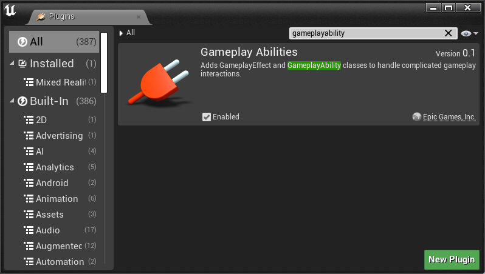

- 在UE C++项目的配置文件`project_name_xxxx.build.cs`中添加相应的依赖
```cpp
PrivateDependencyModuleNames.AddRange(
    new string[] {
        // ...
        "GameplayAbilities",
        "GameplayTags",
        "GameplayTasks",
    }
);
```

整个项目使用cpp来实现高层接口（如库存查询，向库存添加物品，从库存移除物品，库存变动通知，角色属性变动通知...）然后blueprint依赖这些接口实现具体的游戏逻辑（如库存变动时更改UI，角色属性变动时播放动画...），关于在UE项目中使用cpp还是blueprint有可以参考[Converting Blueprint to C++](https://dev.epicgames.com/community/learning/courses/KJ/unreal-engine-converting-blueprint-to-c)

## 图例

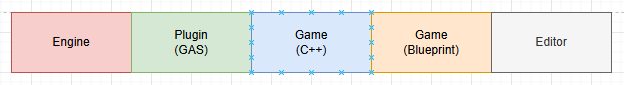

## 参考链接

- 文章中的配图使用drawio绘制，[这里](./unreal-project-action-rpg.drawio)可以找到原始草稿

- 官方文档[Action RPG Game](https://dev.epicgames.com/documentation/en-us/unreal-engine/action-rpg-game?application_version=4.27)


# 1. Action RPG游戏的设定和玩法

在正式讲解Action RPG游戏的实现前，我们先要清楚这个示例项目的玩法和规则，这有助于我们更容易理解后面具体实现中各种数据结构与逻辑流程的含义和关系。

## 输入控制

先来看看游戏的按键绑定（这里使用的是键鼠，原项目也对手柄做了适配）：

\---------------
- WASD - 前后左右移动
- 鼠标右键按下 - 翻滚
- 左Ctrl - 奔跑
- 鼠标水平/垂直滑动 - 控制视角

\---------------
- 鼠标左键按下 - 普通攻击
- F - 魔法攻击
- 鼠标滚轮 - 切换武器

\---------------
- Tab - 打开玩家背包/库存
- R - 使用物品

要快速查看这些按键绑定可以打开`Project Settings -> Input -> Bindings -> Action/Axis Mappings`，这种配置方式也说明这个项目使用了传统的(UE4)Input System方案，从UE5.1开始，可以使用新的Enhanced Input System方案，后者提供了更多的灵活性和可扩展性。

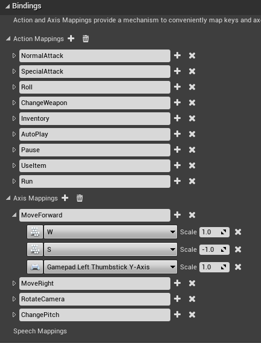

这些按键绑定涉及3个常见部分，玩家角色的运动输入、技能释放和库存操作。

项目中使用了一种非常经典的运动控制方式，相机始终跟随角色，并且我们可以自由改变角色的观察视角，角色拥有移动、奔跑、翻滚的能力;玩家控制的角色主要拥有两类技能，一类是借助近战武器释放的攻击技能，另一类是魔法攻击技能；在玩家库存中，我们可以配置玩家道具栏（3把武器、1个魔法技能和1个药瓶），也可以使用SOUL来购买各类道具。

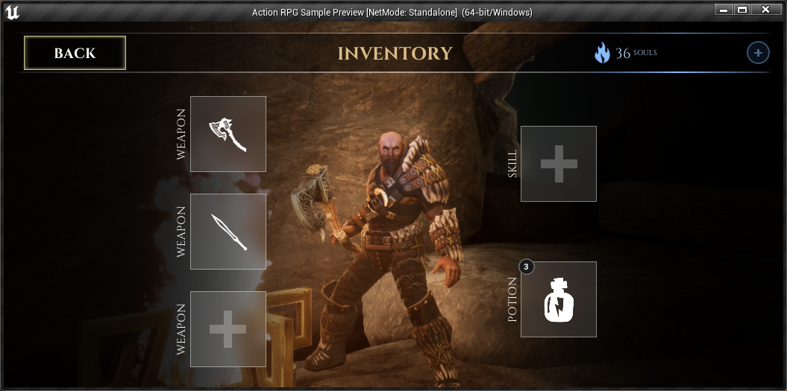

## 玩法

Action RPG的玩法非常简单，玩家需要在有限的时间内抵挡一波又一波刷新出的敌人，杀死的敌人越多，得分越高。
当然，为了增加游戏的乐趣，杀死敌人时有可能掉落一些道具（药瓶，稀有武器，魂...），也会给玩家一定的时间奖励。

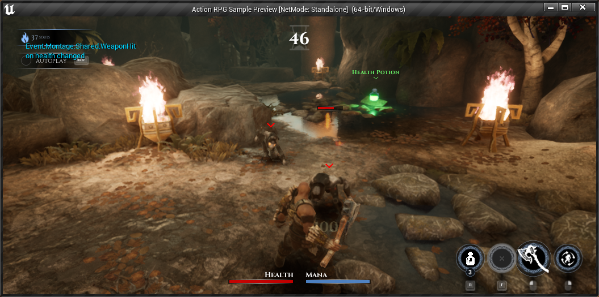

## 道具

下面来看看游戏内可用的道具，当我们理解了项目实现（如何使用GAS）我们可以非常方便的添加新道具，这说明了使用GAS的必要性可GAS本身的可扩展性
- 近战武器（斧类，剑类，锤类）
- 魔法
    - 消耗蓝条，释放魔法技能，这类技能往往是远程的
- 药瓶（回蓝，回血）
- 魂(SOUL)
    - 这个概念源于魂类游戏，魂是这类游戏中的代币，我们可以收集魂来购买前面提到的道具

这些道具都需要我们去使用，我们可以把它们都看成玩家或NPC释放的一种技能/`Ability`（如玩家释放魔法技能）；使用后都会触发某种效果/`Effect`（如使用药瓶回复玩家血量）；而技能目标/`Target`可能是玩家也可能是敌人（如玩家挥动斧头，对范围内的敌人造成伤害）...这些技能使用过程中的共性构成了GAS系统中的核心概念，这些概念会贯穿我们整个系列文章。

上面我们提到了技能目标/`Target`这一概念，这表示一个伤害技能，从玩家角度看，玩家释放了一种伤害技能，伤害目标是NPC，而从NPC的角度看，释放技能的是NPC，伤害目标则变成了玩家，这两者并没有本质不同，所以GAS能让我们为游戏中的各种主体配置技能，这可以制造出各种好玩的效果，也能简化和提高开发效率。

# 2. 玩家的装备槽与库存系统

## 物品分类

游戏中的物品可分成4个大类，分别是`Potion`, `Skill`, `Token`, `Weapon`，每类物品都对应一个class，当然为了包含一些物品共有的数据，项目使用了一个一般物品类`URPGItem`作为这几类物品的基类：
```cpp
class URPGPotionItem;   // 各种药瓶
class URPGSkillItem;    // 各种魔法武器
class URPGTokenItem;    // 代币(SOUL)
class URPGWeaponItem;   // 各种近战武器
```

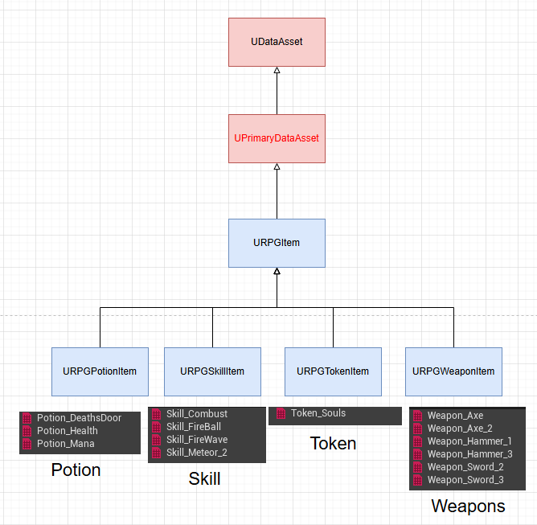


## 库存

```cpp
/** Map of all items owned by this player, from definition to data */
UPROPERTY(VisibleAnywhere, BlueprintReadOnly, Category = Inventory)
TMap<URPGItem*, FRPGItemData> InventoryData;
```

这个变量代表玩家当前的整个库存信息，这是一个从物品`URPGItem`到物品数据`FRPGItemData`的映射。下面有这两个类的摘要。
- 添加库存，移除库存等接口会更新这个变量
- 保存和加载库存等接口会序列化这个变量以达到存档和读档的目的
- 库存信息变动时，Native会发送通知，这会到达UI逻辑部分从而使UI显示得到更新
- ...


```cpp
class URPGItem : public UPrimaryDataAsset {
public:
    FPrimaryAssetType ItemType; // 物品类型
    FText ItemName;             // 物品名，用于UI显示
    FText ItemDescription;      // 物品描述，用于UI显示
    FSlateBrush ItemIcon;       // 物品图标，用于UI显示
    int32 Price;                // 物品价格，用于购买
    TSubclassOf<URPGGameplayAbility> GrantedAbility;  // 这个物品所赋予的技能
    // ...
};
```

```cpp
struct FRPGItemData {
    int32 ItemCount;        // 物品的库存数量
    int32 ItemLevel;        // 物品等级
    // ...
};
```

## 装备槽Slot

```cpp
/** Map of slot, from type/num to item, initialized from ItemSlotsPerType on RPGGameInstanceBase */
UPROPERTY(VisibleAnywhere, BlueprintReadOnly, Category = Inventory)
TMap<FRPGItemSlot, URPGItem*> SlottedItems;
```

当我们按下`Tab`键时会打开库存界面，在这个界面我们可以配置玩家的装备槽，也即玩家当前所装备的物品（如武器，药瓶，魔法...），而上面这个变量便用来保存玩家的装备信息。这是一个从装备槽`FRPGItemSlot`到物品`URPGItem`的映射，其中`URPGItem`类在上面已经展示过，下面我们来看看`FRPGItemSlot`类
```cpp
/** Struct representing a slot for an item, shown in the UI */
struct FRPGItemSlot {
    FPrimaryAssetType ItemType; // 可装备的物品类型
    int32 SlotNumber;           // 装备槽的索引，从0开始
    // ...
};
```
当玩家在库存界面配置时我们需要更新这个变量；在玩家使用物品，切换武器等接口实现中需要查询这个变量。

以上两个变量是实现库存系统的核心，其它都是围绕这两个变量设计的接口。我们在Controller类`ARPGPlayerControllerBase`中定义这些数据和接口。

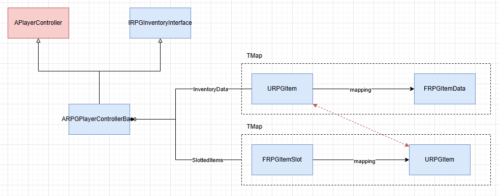


## 库存系统的实现

库存功能相关的实现都在自定义的Controller中，完整代码和实现细节在下面两个文件中可以找到
```cpp
\Source\ActionRPG\Public\RPGPlayerControllerBase.h
\Source\ActionRPG\Private\RPGPlayerControllerBase.cpp
```

- 添加物品

```cpp
/** Adds a new inventory item, will add it to an empty slot if possible. If the item supports count you can add more than one count. It will also update the level when adding if required */
UFUNCTION(BlueprintCallable, Category = Inventory)
bool AddInventoryItem(URPGItem* NewItem, int32 ItemCount = 1, int32 ItemLevel = 1, bool bAutoSlot = true);
```

- 移除物品

```cpp
/** Remove an inventory item, will also remove from slots. A remove count of <= 0 means to remove all copies */
UFUNCTION(BlueprintCallable, Category = Inventory)
bool RemoveInventoryItem(URPGItem* RemovedItem, int32 RemoveCount = 1);
```

- 查询库存 

```cpp
/** Returns all inventory items of a given type. If none is passed as type it will return all */
UFUNCTION(BlueprintCallable, Category = Inventory)
void GetInventoryItems(TArray<URPGItem*>& Items, FPrimaryAssetType ItemType);

/** Returns number of instances of this item found in the inventory. This uses count from GetItemData */
UFUNCTION(BlueprintPure, Category = Inventory)
int32 GetInventoryItemCount(URPGItem* Item) const;

/** Returns the item data associated with an item. Returns false if none found */
UFUNCTION(BlueprintPure, Category = Inventory)
bool GetInventoryItemData(URPGItem* Item, FRPGItemData& ItemData) const;
```

- 加载库存

```cpp
/** Loads inventory from save game on game instance, this will replace arrays */
UFUNCTION(BlueprintCallable, Category = Inventory)
bool LoadInventory();
```

- 保存库存

```cpp
/** Manually save the inventory, this is called from add/remove functions automatically */
UFUNCTION(BlueprintCallable, Category = Inventory)
bool SaveInventory();
```

## 与库存有关的通知/Delegates

有关UE中Delegates的知识，请看这篇blog

- 库存加载完通知

```cpp
/** Delegate called when the entire inventory has been loaded, all items may have been replaced */
DECLARE_DYNAMIC_MULTICAST_DELEGATE(FOnInventoryLoaded);
DECLARE_MULTICAST_DELEGATE(FOnInventoryLoadedNative);

// ...

/** Delegate called when the inventory has been loaded/reloaded */
UPROPERTY(BlueprintAssignable, Category = Inventory)
FOnInventoryLoaded OnInventoryLoaded;

/** Native version above, called before BP delegate */
FOnInventoryLoadedNative OnInventoryLoadedNative;
```

```cpp
/** Delegate called when an inventory item changes */
DECLARE_DYNAMIC_MULTICAST_DELEGATE_TwoParams(FOnInventoryItemChanged, bool, bAdded, URPGItem*, Item);
DECLARE_MULTICAST_DELEGATE_TwoParams(FOnInventoryItemChangedNative, bool, URPGItem*);

// ...

/** Delegate called when an inventory item has been added or removed */
UPROPERTY(BlueprintAssignable, Category = Inventory)
FOnInventoryItemChanged OnInventoryItemChanged;

/** Native version above, called before BP delegate */
FOnInventoryItemChangedNative OnInventoryItemChangedNative;
```

```cpp
/** Delegate called when the contents of an inventory slot change */
DECLARE_DYNAMIC_MULTICAST_DELEGATE_TwoParams(FOnSlottedItemChanged, FRPGItemSlot, ItemSlot, URPGItem*, Item);
DECLARE_MULTICAST_DELEGATE_TwoParams(FOnSlottedItemChangedNative, FRPGItemSlot, URPGItem*);

// ...

/** Delegate called when an inventory slot has changed */
UPROPERTY(BlueprintAssignable, Category = Inventory)
FOnSlottedItemChanged OnSlottedItemChanged;

/** Native version above, called before BP delegate */
FOnSlottedItemChangedNative OnSlottedItemChangedNative;
```

# 3. 使用GAS

前面几篇的内容基本覆盖了玩家怎样操作（玩法）、获得物品、配置物品（库存）等方面的实现，接下来是使用物品，也就是物品怎样起作用，这是GAS主要发挥作用的地方，下面我们先通过捡药瓶、用药瓶来将GAS的使用流程串联起来，之后再将其中涉及的GAS重要概念展开。

捡药瓶、用药瓶这两个过程分别对应了玩家获得物品与使用物品，其它物品的获得和使用与药瓶类似，获得物品时（更准确的说是物品被玩家装备时），玩家被赋予了相应的技能，而使用物品时，相应的技能被激活。

## 捡药瓶

玩家捡药瓶的逻辑使用blueprint实现`/Game/Items/Pickups/BP_RPGItem_Pickup_Base.BP_RPGItem_Pickup_Base`，当检测到玩家与药瓶重叠时，我们会播放收集动画、播放收集声音，并在玩家库存中添加药瓶，这会调用下面这个cpp接口

```cpp
// \Source\ActionRPG\Public\RPGPlayerControllerBase.h
UFUNCTION(BlueprintCallable, Category = Inventory)
bool AddInventoryItem(URPGItem* NewItem, int32 ItemCount = 1, int32 ItemLevel = 1, bool bAutoSlot = true);
```

库存相关的数据结构在[6. 玩家的物品栏与库存系统](./inventory.md)中讲过。

下面是`AddInventoryItem`函数的调用链

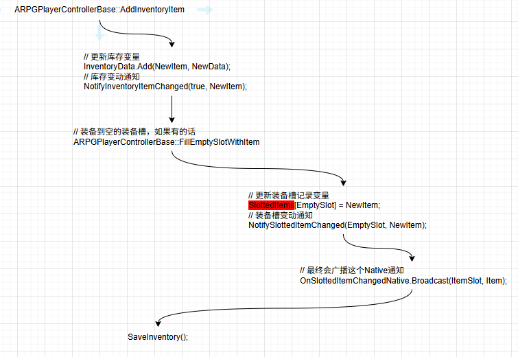

这个函数首先会更新药瓶的库存数据。之后的两个动作很重要，首先它在必要的时候**更新装备槽**，之后会**发出装备槽变动通知`OnSlottedItemChangedNative`**，在`ARPGCharacterBase`的`PossessedBy`时，有对`OnSlottedItemChangedNative`代理的一个订阅

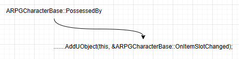

这会在收到`OnSlottedItemChangedNative`通知时调用`ARPGCharacterBase::OnItemSlotChanged`,下面是这个函数的调用链

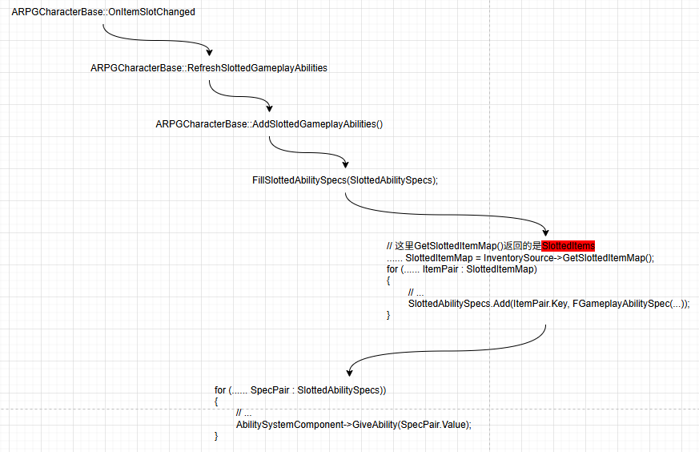

这个调用链最终会将物品（比如这里的药瓶）所携带的技能`GrantedAbility`通过`UAbilitySystemComponent::GiveAbility`接口注册进玩家的GAS。

## 技能授予

授予（grant）技能使用由`UAbilitySystemComponent`提供的`GiveAbility`接口，`UAbilitySystemComponent`类是我们游戏代码与GAS交互的核心组件`Component`，几乎每个使用GAS的游戏都需要创建一个它的子类，来提供一些交互功能，下面是Action RPG项目中定义的子类

```cpp
// \Source\ActionRPG\Public\Abilities\RPGAbilitySystemComponent.h
class URPGAbilitySystemComponent : public UAbilitySystemComponent
{
    GENERATED_BODY()
public:
    URPGAbilitySystemComponent();
    void GetActiveAbilitiesWithTags(const FGameplayTagContainer& GameplayTagContainer, TArray<URPGGameplayAbility*>& ActiveAbilities);
    int32 GetDefaultAbilityLevel() const;
    static URPGAbilitySystemComponent* GetAbilitySystemComponentFromActor(const AActor* Actor, bool LookForComponent = false);
};
```

在`ARPGCharacterBase`类中我们声明并创建这个对象

```cpp
// \Source\ActionRPG\Public\RPGCharacterBase.h
class ACTIONRPG_API ARPGCharacterBase : ..., public `IAbilitySystemInterface`, ...
{
    GENERATED_BODY()

public:
    // Constructor and overrides
    ARPGCharacterBase();

    // Implement IAbilitySystemInterface
    UAbilitySystemComponent* GetAbilitySystemComponent() const override;

    /** The component used to handle ability system interactions */
    UPROPERTY()
    URPGAbilitySystemComponent* AbilitySystemComponent;
  
    // ...
};
```

```cpp
// \Source\ActionRPG\Private\RPGCharacterBase.cpp
ARPGCharacterBase::ARPGCharacterBase()
{
    // Create ability system component, and set it to be explicitly replicated
    AbilitySystemComponent = CreateDefaultSubobject<URPGAbilitySystemComponent>(TEXT("AbilitySystemComponent"));
    AbilitySystemComponent->SetIsReplicated(true);
    // ...
}
```

我们的`ARPGCharacterBase`类需要实现接口`IAbilitySystemInterface`的`GetAbilitySystemComponent`函数，通过这种方式GAS可以得到我们创建的组件对象并按预期工作。

`UAbilitySystemComponent`组件提供了众多接口，这些接口涉及GameAbility的授予，GameAbility的中断和取消，GameEffect的应用，GameplayTag的操作，GameplayCues...

`GiveAbility`用来向GAS注册一个技能，这是GAS组件最基本的任务，我们不会深究这个函数做了什么，因为那可能涉及到GAS系统的实现，现阶段我们不妨将GAS当成一个黑盒，通过调用它提供的众多接口，来让它为我们的游戏功能服务。

```cpp
/** Grants Ability. Returns handle that can be used in TryActivateAbility, etc. */
FGameplayAbilitySpecHandle GiveAbility(const FGameplayAbilitySpec& AbilitySpec);
```

## 什么是技能/GameAbility/GA

上一节，我们已经梳理了项目中从捡到物品到将物品所携带的技能力注册进GAS的过程，那么什么是技能(GA)？怎么为我们的游戏物品关联GA？...这便是本节我们要解决的问题。

GameAbility是GAS中的核心概念，在使用GAS开发一个游戏项目时，我们最重要的任务之一就是为项目构建起一个适当的GA继承体系。比如我们的游戏角色有恢复技能，而这个技能又分成回血技能和回蓝技能，我们可以向下面这样构建这个简单的GA体系:

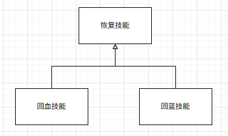

上图中的箭头表示继承，而GAS插件已经为我们提供了`UGameplayAbility`来作为项目中所有GA类的基类，我们只需要继承这个类然后拓展我们自己的GA即可。
(`...\Engine\Plugins\Runtime\GameplayAbilities\Source\GameplayAbilities\Public\Abilities\GameplayAbility.h`)

- 技能生命周期的管理，如激活技能，提交技能，取消技能，技能结束...
- 输入相关的接口
- 动画相关的接口
- ...

下面是Action RPG游戏中的整个GA继承体系

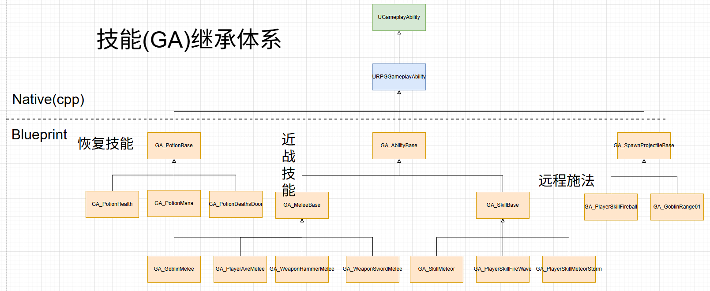

游戏中所有技能都直接或间接继承自`UGameplayAbility`，这个类来自GAS插件内部，前面我们提到过；另外一般会创建一个针对自己游戏项目的技能根类，这里也就是`URPGGameplayAbility`，这个类可以让我们很方便的添加特定于我们游戏的数据。Action RPG项目中使用`GameplayTag`来分派技能，所以很多跟Tags相关的操作都放进这个根类里，后面我们可以看到更多细节。

## 用药瓶

TODO

## 什么是效果/GameEffect/GE

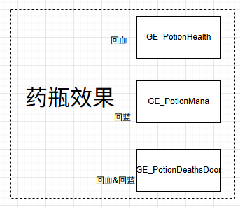

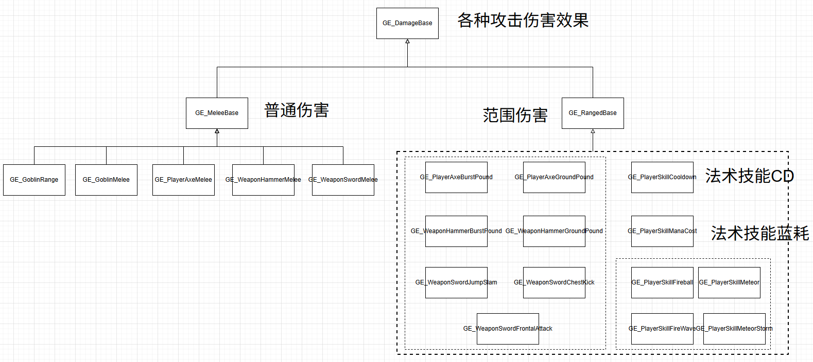

TODO

# 4. 与GAS交互

`UGameplayAbility`提供的关键接口

```cpp
// \Engine\Plugins\Runtime\GameplayAbilities\Source\GameplayAbilities\Public\Abilities\GameplayAbility.h

// ----------------------------------------------------------------------------------------------------------------
//
//	The important functions:
//	
//		CanActivateAbility()	- const function to see if ability is activatable. Callable by UI etc
//
//		TryActivateAbility()	- Attempts to activate the ability. Calls CanActivateAbility(). Input events can call this directly.
//								- Also handles instancing-per-execution logic and replication/prediction calls.
//		
//		CallActivateAbility()	- Protected, non virtual function. Does some boilerplate 'pre activate' stuff, then calls ActivateAbility()
//
//		ActivateAbility()		- What the abilities *does*. This is what child classes want to override.
//	
//		CommitAbility()			- Commits reources/cooldowns etc. ActivateAbility() must call this!
//		
//		CancelAbility()			- Interrupts the ability (from an outside source).
//
//		EndAbility()			- The ability has ended. This is intended to be called by the ability to end itself.
//	
// ----------------------------------------------------------------------------------------------------------------
```

`UGameplayAbility`提供的与应用GE有关的几个接口

```cpp
// \Engine\Plugins\Runtime\GameplayAbilities\Source\GameplayAbilities\Public\Abilities\GameplayAbility.h

// -------------------------------------
//  Apply Gameplay effects to Target
// -------------------------------------

... BP_ApplyGameplayEffectToTarget(...);
... ApplyGameplayEffectToTarget(...) const;
... K2_ApplyGameplayEffectSpecToTarget(...);
... ApplyGameplayEffectSpecToTarget(...) const;
```

`FGameplayEffectSpecHandle`

`FGameplayEffectSpec`

```cpp
/** Convenience method for abilities to get outgoing gameplay effect specs (for example, to pass on to projectiles to apply to whoever they hit) */
UFUNCTION(BlueprintCallable, Category=Ability)
FGameplayEffectSpecHandle MakeOutgoingGameplayEffectSpec(TSubclassOf<UGameplayEffect> GameplayEffectClass, float Level=1.f) const;
```

`FGameplayAbilityTargetDataHandle `

`FGameplayAbilityTargetData`

`FActiveGameplayEffectHandle`

## GA <-> GE

GA是技能的抽象，GE最终完成对数值的修改（如玩家使用药瓶后生命值增加），很明显从GA到GE需要某种映射关系，下面我们看看Action RPG Game中是怎样构建这种映射关系的，更进一步，怎样用Gameplay Tags来简化这种映射关系。

在完成技能释放后，如玩家按下了使用药瓶，我们播放了喝药Montage，接下来需要让技能关联的GE发挥作用
`/Content/Abilities/Shared/GA_PotionBase.uasset`

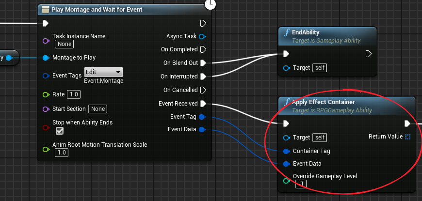

我们使用了`ApplyEffectContainer`函数来完成这个任务，下面来看看这个函数的调用链
`\Source\ActionRPG\Public\Abilities\RPGGameplayAbility.cpp`

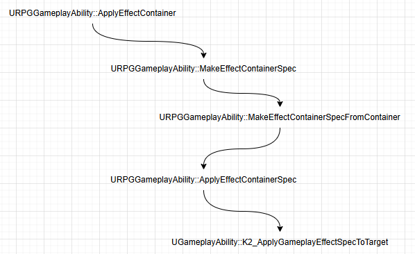

这个函数的主要任务是准备GAS需要的GE数据，并最终调用`K2_ApplyGameplayEffectSpecToTarget`来应用这些GE。

而这个任务可分成两个步骤

1. 根据传入的Tag来找到需要应用的GE类（和应用Target）
2. 用找到的GE类创建GE应用接口需要的数据，最终应用这些GE

\------------- 步骤1 -------------

在介绍GA的部分，我们创建过一个的GA的基类`URPGGameplayAbility`，一些特定于我们游戏GA的数据会被定义在这个类中，我们用`EffectContainerMap`类型的变量来记录与当前GA关联的所有GE

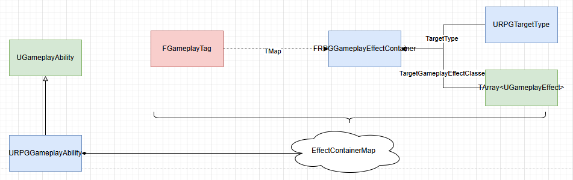

这个变量是一个从Tag到GE的映射，当然这些映射关系不会凭空产生，在我们创建GA时通过UE编辑器指定，比如下面这个药瓶技能`GA_PotionHealth`

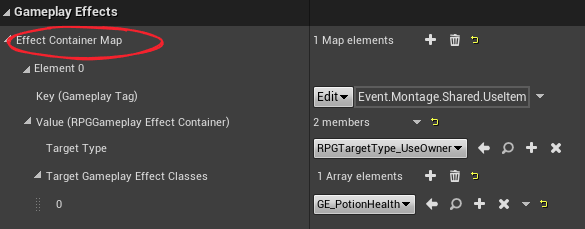

这里只有一个映射关系，我们选择了一个特定Tag，提供了GE类和GE要应用到的目标，后两者我们会在[GE部分](#)进一步探讨。


\------------- 步骤2 -------------

GE的应用接口`K2_ApplyGameplayEffectSpecToTarget`的函数签名如下

```cpp
// \Engine\Plugins\Runtime\GameplayAbilities\Source\GameplayAbilities\Public\Abilities\GameplayAbility.h
/** Apply a previously created gameplay effect spec to a target */
UFUNCTION(BlueprintCallable, Category = Ability, DisplayName = "ApplyGameplayEffectSpecToTarget", meta=(ScriptName = "ApplyGameplayEffectSpecToTarget"))
TArray<FActiveGameplayEffectHandle> K2_ApplyGameplayEffectSpecToTarget(const FGameplayEffectSpecHandle EffectSpecHandle, FGameplayAbilityTargetDataHandle TargetData);
```

这个步骤我们基本上就是准备参数`FGameplayEffectSpecHandle`和`FGameplayAbilityTargetDataHandle`。

前者是一个GE句柄，方便我们引用，使用GAS提供的接口`UGameplayAbility::MakeOutgoingGameplayEffectSpec`可以从`UGameplayEffect`类直接创建一个GE句柄，下面是这几个类的关系

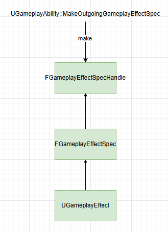

后者是GE要应用到的目标，也是一个句柄，因为一个GE可能同时应用于多个目标，所以GE与Target之间是一对多的关系

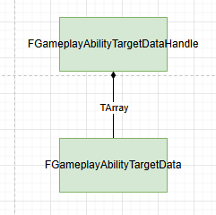

GE的Target是一个很重要的概念，这部分我们会在[准备GE的Target](#)中详述。

回顾步骤1中的`EffectContainerMap`变量，这几乎就是创建步骤2中所需数据的全部，这样我们就有了一个使用Tag来应用相关游戏效果的完整逻辑链，当然项目中借助了一个中间类型`FRPGGameplayEffectContainerSpec`来管理这些数据的传递，其本质只是一个容器wrapper

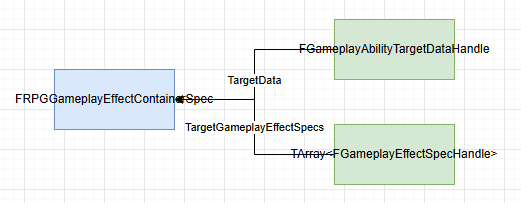

# 5. 为GE准备Target

在前面介绍应用GE接口`K2_ApplyGameplayEffectSpecToTarget`时，它的第二个参数是个类型为`FGameplayAbilityTargetDataHandle`的变量，我们说过通过这个参数我们提供给GE要应用的到的目标，这些目标类型应该如何实现？又怎样与游戏的其它逻辑结合在一起？这是我们这节要解决的问题。


Action RPG Game中的TargetType类体系

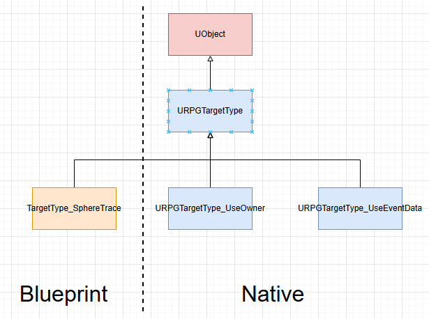


在基类`URPGTargetType`中我们定义了下面的接口用来返回找到的目标

```cpp
// \Source\ActionRPG\Public\Abilities\RPGTargetType.h
/** Called to determine targets to apply gameplay effects to */
UFUNCTION(BlueprintNativeEvent)
void GetTargets(ARPGCharacterBase* TargetingCharacter, AActor* TargetingActor, FGameplayEventData EventData, TArray<FHitResult>& OutHitResults, TArray<AActor*>& OutActors) const;
```

`URPGTargetType_UseOwner`类非常简单，只是把技能的拥有者作为目标返回，像玩家使用药瓶来为自己恢复血条或蓝条，使用这种类是非常合适的。

`URPGTargetType_UseEventData`类可以让我们从参数`EventData`中解析目标并返回，这方便我们通过事件传递目标。

上面这两个类都直接使用cpp定义，因为这两个类返回Targets的逻辑都非常简单。另外，想象这样一种场景，玩家将斧头插入大地，造成范围崩坏，所有在范围内的敌人都会受到伤害，很明显，这种伤害效果(GE)需要应用到范围内的每一个敌人，这便是`TargetType_SphereTrace`类的用武之地。通过使用blueprint实现这类TargetType，可以借助blueprint提供的实用函数，也更方便我们调试。

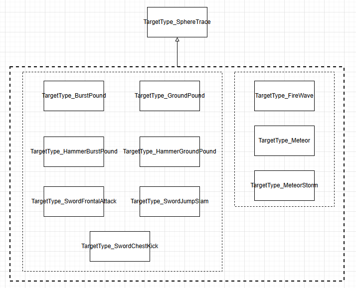

针对玩家不同武器不同攻击类型造成的伤害效果，我们使用不同的目标查询类，比如横扫、地面范围、法术范围.....

这类目标查询主要依赖于[UE的射线检测](./ue-raycast.md)，如`TargetType_SphereTrace`中`GetTargets`接口使用`MultiSphereTraceForObjects`来实现`/Content/Abilities/Shared/TargetType_SphereTrace.uasset`

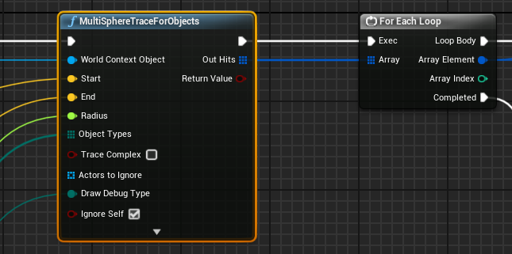

下面让我们看两个具体实例，展示了三种TargetType类型的应用方式

## URPGTargetType_UseOwner

我们常用的一个例子是玩家使用药瓶，`GA_PotionHealth`是回血技能，与这个GA关联的GE如下`/Content/Abilities/Player/Potions/GA_PotionHealth.uasset`


这里的TargetType是`URPGTargetType_UseOwner`，前面说过，它返回的目标是使用技能者本身，下面是其`GetTargets`接口实现

```cpp
// \Source\ActionRPG\Private\Abilities\RPGTargetType.cpp
void URPGTargetType_UseOwner::GetTargets_Implementation(ARPGCharacterBase* TargetingCharacter, AActor* TargetingActor, FGameplayEventData EventData, TArray<FHitResult>& OutHitResults, TArray<AActor*>& OutActors) const
{
    OutActors.Add(TargetingCharacter);
}
```
这里直接将技能使用者添加到返回的目标数组，所以玩家使用药瓶后会给自身加血。当然如果我们让敌人拥有了这个技能，敌人也可以在自身处于濒死边缘时给自己回血，这会让玩家与敌人博弈时更有乐趣。


## URPGTargetType_UseEventData、TargetType_SphereTrace

`GA_PlayerAxeMelee`作为一种武器技能(GA)可以产生伤害效果(GE)，它的伤害效果可分为普通伤害和范围伤害，下面是我们为它关联的GEs`/Content/Abilities/Player/Axe/GA_PlayerAxeMelee.uasset`

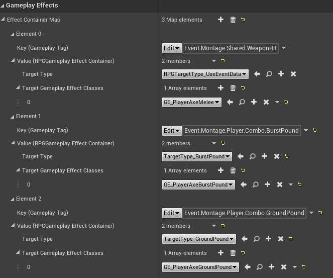

它同时包含3种伤害效果，第一种使用了URPGTargetType_UseEventData来传递武器触碰到的敌人；第二、三种是范围伤害，我们使用射线检测来返回范围内的目标。

- `GE_PlayerAxeMelee` 使用`URPGTargetType_UseEventData`传递目标
- `GE_PlayerAxeBurstPound` 使用`TargetType_SphereTrace`子类`TargetType_BurstPound`查询目标
- `GE_PlayerAxeGroundPound` 使用`TargetType_SphereTrace`子类`TargetType_GroundPound`查询目标

在`WeaponActor`类的碰撞检测函数`ActorBeginOverlap`中，我们使用`SendGameplayEventToActor`的`Payload`参数将碰撞到的目标发送出去，这个事件会激活对应Actor的技能，我们在[实现一个Ability Task](#)中会继续探讨。最终这个包含目标信息的`Payload`会被`URPGTargetType_UseEventData`实现的`GetTargets`接口解析

```cpp
void URPGTargetType_UseEventData::GetTargets_Implementation(ARPGCharacterBase* TargetingCharacter, AActor* TargetingActor, FGameplayEventData EventData, TArray<FHitResult>& OutHitResults, TArray<AActor*>& OutActors) const
{
    const FHitResult* FoundHitResult = EventData.ContextHandle.GetHitResult();
    if (FoundHitResult)
    {
        OutHitResults.Add(*FoundHitResult);
    }
    else if (EventData.Target)
    {
        OutActors.Add(const_cast<AActor*>(EventData.Target));
    }
}
```

`TargetType_BurstPound`和`TargetType_GroundPound`都是`TargetType_SphereTrace`子类，都使用Swip Sphere这种射线检测方式来查询目标，它们的区别在于使用不同的Swip长度和Sphere半径，这是通过父蓝图公开给子类的变量实现的`/Content/Abilities/Player/Axe/TargetType_BurstPound.uasset`

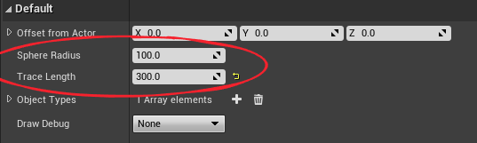

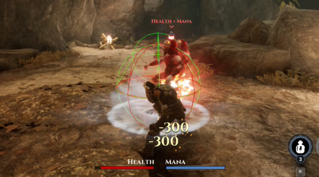

 上图为`TargetType_GroundPound`查询目标时的调试线框

# 6. 实现一个Ability Task

 TODO

# 7. 初始技能与被动效果

在NPC与玩家角色的基类`ARPGCharacterBase`中，`PassiveGameplayEffects`变量用来定义角色一开始要应用的效果，这个变量在UE编辑器中指定具体的GE类

```cpp
/** Passive gameplay effects applied on creation */
UPROPERTY(EditDefaultsOnly, BlueprintReadOnly, Category = Abilities)
TArray<TSubclassOf<UGameplayEffect>> PassiveGameplayEffects;
```

下面是玩家、NPC和Boss被动效果类的继承关系

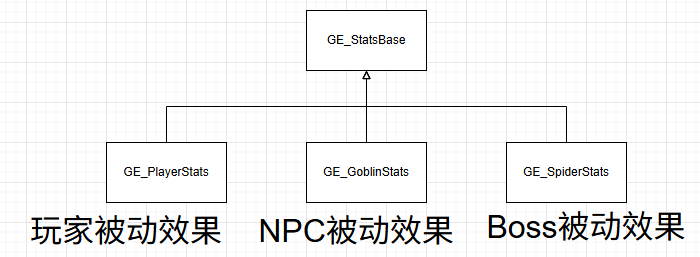

## 玩家的被动效果

`/Content/Blueprints/BP_PlayerCharacter.uasset`

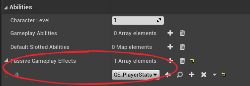

`GE_PlayerStats`基本上相当于给玩家角色的属性（如`Health`，`Mana`...）一组初始值（通过GE的Override操作实现），这些值我们从`Curve Table`类型的资源文件中读取
`/Content/Abilities/Player/GE_PlayerStats.uasset`

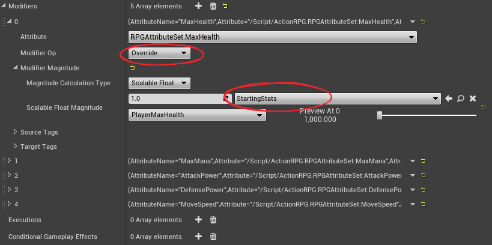

下面是`StartingStats`文件内容，上图中我们指定了要使用的字段(如`PlayerMaxHealth`)

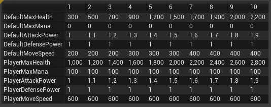

在游戏一开始会调用`ARPGCharacterBase`的`AddStartupGameplayAbilities`接口，这个接口会将初始技能和效果应用到角色身上

```cpp
void ARPGCharacterBase::AddStartupGameplayAbilities()
{
    check(AbilitySystemComponent);
    
    if (GetLocalRole() == ROLE_Authority && !bAbilitiesInitialized)
    {
        // 授予初始技能	
        for (TSubclassOf<URPGGameplayAbility>& StartupAbility : GameplayAbilities)
        {
            AbilitySystemComponent->GiveAbility(FGameplayAbilitySpec(StartupAbility, GetCharacterLevel(), INDEX_NONE, this));
        }

        // 应用初始（被动）效果
        for (TSubclassOf<UGameplayEffect>& GameplayEffect : PassiveGameplayEffects)
        {
            FGameplayEffectContextHandle EffectContext = AbilitySystemComponent->MakeEffectContext();
            EffectContext.AddSourceObject(this);

            FGameplayEffectSpecHandle NewHandle = AbilitySystemComponent->MakeOutgoingSpec(GameplayEffect, GetCharacterLevel(), EffectContext);
            if (NewHandle.IsValid())
            {
                FActiveGameplayEffectHandle ActiveGEHandle = AbilitySystemComponent->ApplyGameplayEffectSpecToTarget(*NewHandle.Data.Get(), AbilitySystemComponent);
            }
        }

        AddSlottedGameplayAbilities();

        bAbilitiesInitialized = true;
    }
}
```

## NPC的被动效果

`/Content/Blueprints/NPC/NPC_GoblinBP.uasset`

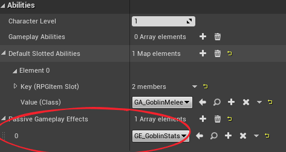

NPC的被动效果使用`GE_GoblinStats`类，其作用方式与玩家的一样，也使用同样的数据表`StartingStats`，只是从表中读取了不同的字段。

## NPC的初始技能

NPC的初始技能通过变量`DefaultSlottedAbilities`指定

```cpp
/** Map of item slot to gameplay ability class, these are bound before any abilities added by the inventory */
UPROPERTY(EditAnywhere, BlueprintReadOnly, Category = Abilities)
TMap<FRPGItemSlot, TSubclassOf<URPGGameplayAbility>> DefaultSlottedAbilities;
```

授予这些初始技能涉及`ARPGCharacterBase`的两个接口

```cpp
void ARPGCharacterBase::FillSlottedAbilitySpecs(TMap<FRPGItemSlot, FGameplayAbilitySpec>& SlottedAbilitySpecs)
{
    // First add default ones
    for (const TPair<FRPGItemSlot, TSubclassOf<URPGGameplayAbility>>& DefaultPair : DefaultSlottedAbilities)
    {
        if (DefaultPair.Value.Get())
        {
            SlottedAbilitySpecs.Add(DefaultPair.Key, FGameplayAbilitySpec(DefaultPair.Value, GetCharacterLevel(), INDEX_NONE, this));
        }
    }

    [...]
}

void ARPGCharacterBase::AddSlottedGameplayAbilities()
{
    TMap<FRPGItemSlot, FGameplayAbilitySpec> SlottedAbilitySpecs;
    FillSlottedAbilitySpecs(SlottedAbilitySpecs);
    
    // Now add abilities if needed
    for (const TPair<FRPGItemSlot, FGameplayAbilitySpec>& SpecPair : SlottedAbilitySpecs)
    {
        FGameplayAbilitySpecHandle& SpecHandle = SlottedAbilities.FindOrAdd(SpecPair.Key);

        if (!SpecHandle.IsValid())
        {
            SpecHandle = AbilitySystemComponent->GiveAbility(SpecPair.Value);
        }
    }
}
```

## Boss的初始技能与被动效果

`/Content/Blueprints/Boss/NPC_SpiderBoss.uasset`

Boss的初始技能通过变量`GameplayAbilities`指定

```cpp
/** Abilities to grant to this character on creation. These will be activated by tag or event and are not bound to specific inputs */
UPROPERTY(EditAnywhere, BlueprintReadOnly, Category = Abilities)
TArray<TSubclassOf<URPGGameplayAbility>> GameplayAbilities;
```

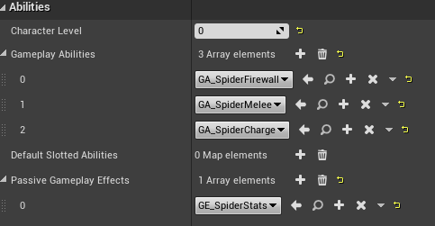


# 8. 技能激活、蓝耗与冷却

## 技能激活

Action RPG Game在下面两个函数中调用了激活技能的接口

```cpp
bool ARPGCharacterBase::ActivateAbilitiesWithItemSlot(FRPGItemSlot ItemSlot, bool bAllowRemoteActivation)
{
    FGameplayAbilitySpecHandle* FoundHandle = SlottedAbilities.Find(ItemSlot);

    if (FoundHandle && AbilitySystemComponent)
    {
        return AbilitySystemComponent->TryActivateAbility(*FoundHandle, bAllowRemoteActivation);
    }

    return false;
}
```

这个函数方便我们用物品来激活其对应的技能，其中用到了GAS激活技能的接口`TryActivateAbility`

```cpp
/** 
 * Attempts to activate the given ability, will check costs and requirements before doing so.
 * Returns true if it thinks it activated, but it may return false positives due to failure later in activation.
 * If bAllowRemoteActivation is true, it will remotely activate local/server abilities, if false it will only try t locally activate the ability
 */
bool TryActivateAbility(FGameplayAbilitySpecHandle AbilityToActivate, bool bAllowRemoteActivation = true);
```

```cpp
bool ARPGCharacterBase::ActivateAbilitiesWithTags(FGameplayTagContainer AbilityTags, bool bAllowRemoteActivation)
{
    if (AbilitySystemComponent)
    {
        return AbilitySystemComponent->TryActivateAbilitiesByTag(AbilityTags, bAllowRemoteActivation);
    }

    return false;
}
```

这个函数在玩家使用法术技能时`DoSkillAttack`被调用，其中使用了GAS激活技能的接口`TryActivateAbilitiesByTag`

```cpp
/** 
 * Attempts to activate every gameplay ability that matches the given tag and DoesAbilitySatisfyTagRequirements().
 * Returns true if anything attempts to activate. Can activate more than one ability and the ability may fail later.
 * If bAllowRemoteActivation is true, it will remotely activate local/server abilities, if false it will only try to locally activate abilities.
 */
UFUNCTION(BlueprintCallable, Category = "Abilities")
bool TryActivateAbilitiesByTag(const FGameplayTagContainer& GameplayTagContainer, bool bAllowRemoteActivation = true);
```

这最终会调用我们在GA基类中覆盖的`ActivateAbility`函数，下面是`GA_MeleeBase`类中的实现，其它GA基类与这个实现类似

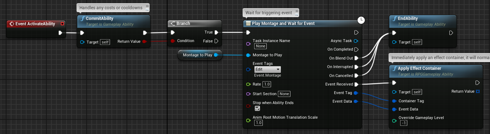

通常我们会调用`CommitAbility`来处理技能的消耗和冷却；调用`EndAbility`结束技能


## 技能蓝耗和冷却

对于Skill类技能（如`GA_PlayerSkillFireball`），这类技能需要消耗法力值，而且技能释放后有CD时间

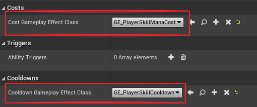

前者`GE_PlayerSkillManaCost`与一般GE类似，与恢复技能相反，这次我们需要减少玩家的法力属性

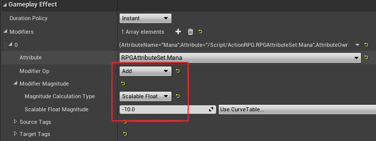

后者`GE_PlayerSkillCooldown`使用的是一种指定间隔时间的GE，通过把`Duration Policy`修改成`Has Duration`实现

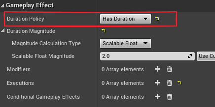

# 9. 调试

运行游戏时使用撇号打开调试器

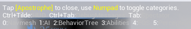

小数字键盘开启或关闭相关调试信息

- 0 - Navmesh
- 1 - AI
- 2 - BehaviorTree
- 3 - Abilities
- 4 - EQS
- 5 - Perception

## 0 - Navmesh

可以显示寻路网格

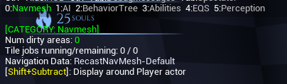


## 1 - AI

根据打开调试器时（按撇号）对准的Character，这里会展示对应的Character信息，比如角色使用的`AIController`，角色使用的`BehaviorTree`,行为树中当前执行的节点...

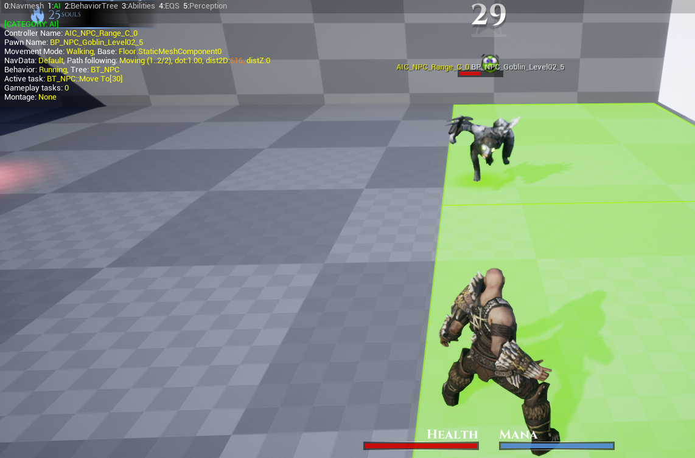


## 2 - BehaviorTree

这会展示使用的行为树的节点执行链，也会打印黑板变量的当前值

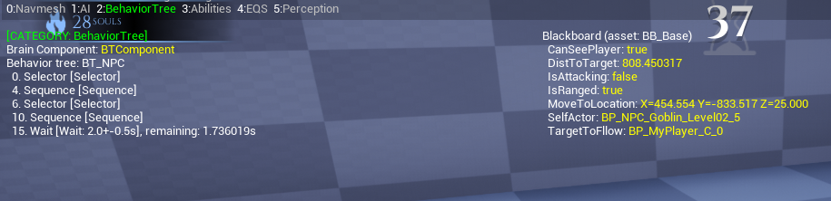

## 3 - Abilities

这会展示对应Character当前激活的技能和当前应用的效果

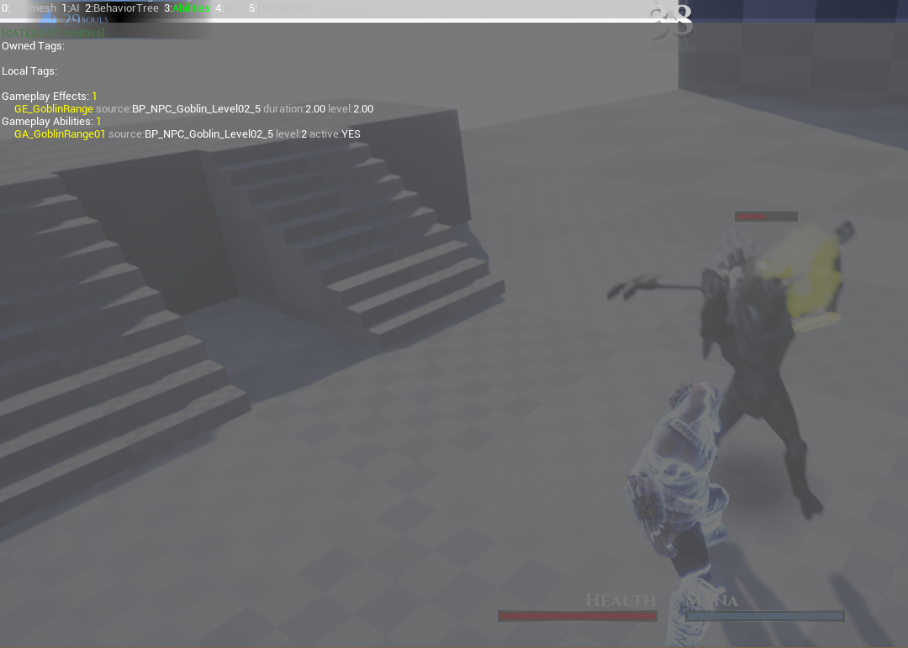

## 4 - EQS

绿点是候选点，Winner为最高分数点

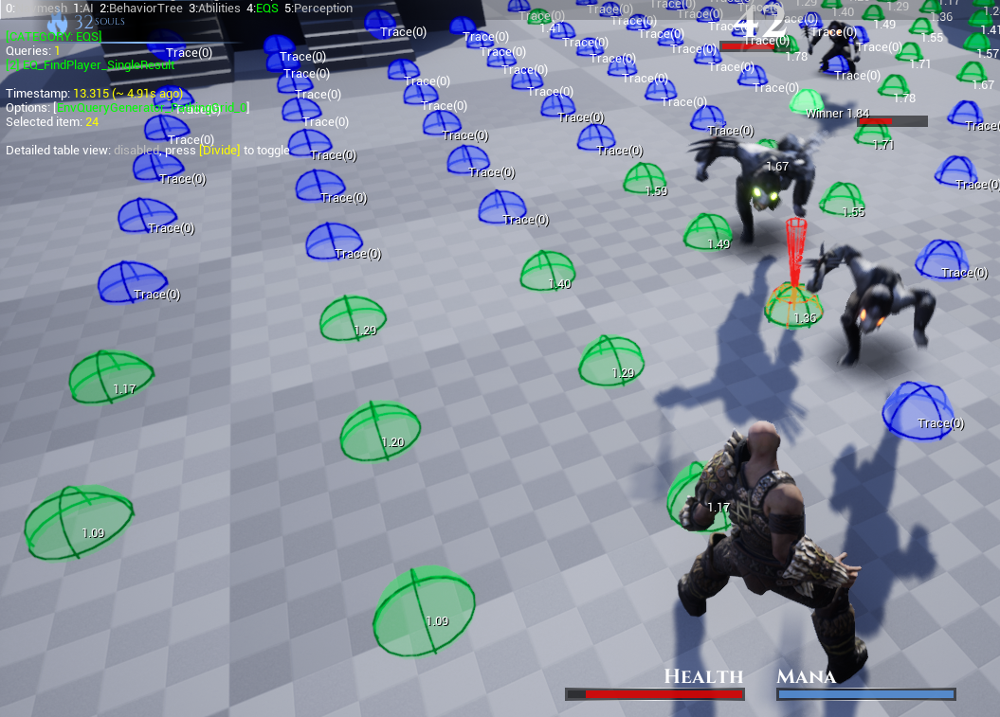

## 5 - Perception

这会展示NPC的感知器线框，绿点表示我们被"看"到

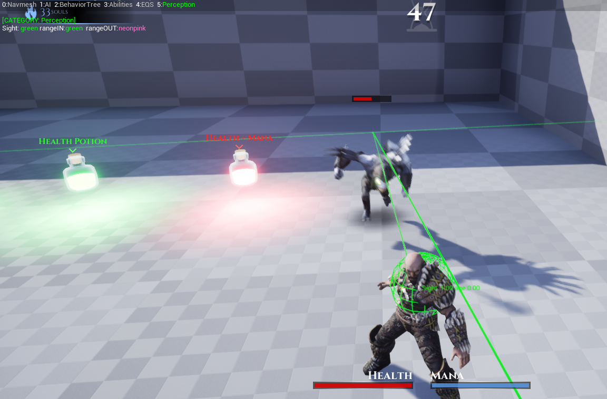

# 10. Unreal Input Systme(Legacy vs Enhanced)

TODO

# 11. Action RPG Game中角色的控制方案

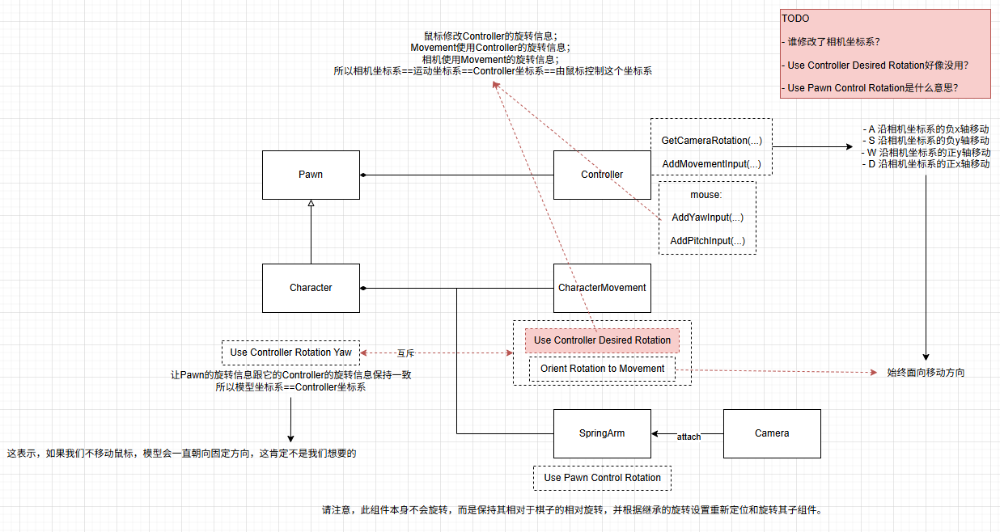

TODO

# 12. UE中的Delegates

代理（Delegates）又叫通知（notify），事件（Events），回调（Callback），广播（Broadcast）...

下面统一叫delegates，因为这也是UE中使用的名字

delegate可以理解成一个订阅/通知模型

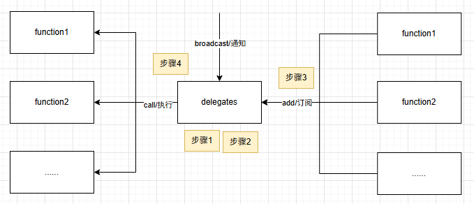

## UE中的delegates

这是一个关于UE中delegates的简短教程，UE中主要的Delegates种类和区别见下表

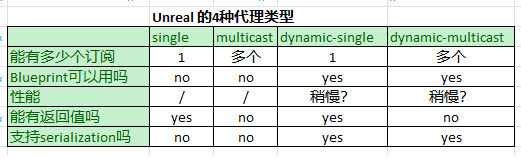

（另外还有一种Sparse Delegates; 使用`DECLARE_DELEGATE`来定义而`DECLARE_EVENT`在UE5中已废弃; Timer也可以被看成一种特殊Delegate???）

动态多播的各种叫法
- Multicast Dynamic
- Dynamic Multicast Delegates
- Dynamic Delegates
- Event Dispatchers (blueprint)
- ...

Dynamic??? Multicast???
- Dynamic表示 可以暴露给Blueprint
- Multicast表示同时可以被多个函数订阅

## UE中delegate用法

使用分4步

1. Define the delegate's signature
2. Create variables of your new delegate
3. Subscribe to the delegate
4. Execute the delegate

下面我们可以结合Action RPG项目中对delegates的使用，来对应以上4个步骤

\------------- 步骤1 -------------

在Action RPG项目的库存系统实现中，一个很重要的delegate是玩家改变了装备槽(slots)，比如这会通知对应的Widget做UI更新。下面是这个通知的定义

```cpp
DECLARE_DYNAMIC_MULTICAST_DELEGATE_TwoParams(FOnSlottedItemChanged, FRPGItemSlot, ItemSlot, URPGItem*, Item);
```

`DECLARE_DYNAMIC_MULTICAST_DELEGATE_TwoParams`是UE定义的宏，其实际是实例出不同Delegate模板类型，见[UE中delegate实现](#ue中delegate实现)。下面是一些类似的名字

```cpp
// \Engine\Source\Runtime\Core\Public\Delegates\DelegateCombinations.h
DECLARE_DELEGATE_OneParam(...)
DECLARE_DELEGATE_TwoParams(...)
DECLARE_DELEGATE_ThreeParams(...)
// ...
DECLARE_MULTICAST_DELEGATE_OneParam(...)
DECLARE_MULTICAST_DELEGATE_TwoParams(...)
DECLARE_MULTICAST_DELEGATE_ThreeParams(...)
// ...
DECLARE_DYNAMIC_DELEGATE_OneParam(...)
DECLARE_DYNAMIC_DELEGATE_TwoParams(...)
DECLARE_DYNAMIC_DELEGATE_ThreeParams(...)
// ...
DECLARE_DYNAMIC_MULTICAST_DELEGATE_OneParam(...)
DECLARE_DYNAMIC_MULTICAST_DELEGATE_TwoParams(...)
DECLARE_DYNAMIC_MULTICAST_DELEGATE_ThreeParams(...)
// ...
// ...
```
这些宏名编码了Delegates的不同类型，如是否支持动态`DYNAMIC`,是否支持多播`MULTICAST`,有几个参数`OneParam...`。在使用是可以根据我们实际的使用需求去查找使用不同的宏。

回头再来看看我们项目中使用的delegate

```cpp
DECLARE_DYNAMIC_MULTICAST_DELEGATE_TwoParams(FOnSlottedItemChanged, FRPGItemSlot, ItemSlot, URPGItem*, Item);
```

这个delegate宏依次定义了delegate的
- 名字`FOnSlottedItemChanged`, 
- 第一个参数的类型`FRPGItemSlot`, 
- 第一个参数的名字`ItemSlot`, 
- 第二个参数的类型`URPGItem*`, 
- 第二个参数的名字`Item`。
- 而且从宏名本身我们知道这是一个支持动态`DYNAMIC`支持多播`MULTICAST`有两个参数`TwoParams`的delegate。

这个delegate会在装备槽(slot)装备的物品变动时发出通知，所有订阅这个通知的函数都会被调用，调用时的第一个参数是哪个装备槽，第二个参数是新装备的物品，有了这些我们就能走下面的逻辑...

让我们再看一个例子

```cpp
DECLARE_DELEGATE_RetVal_TwoParams(bool, FOnDogSucceededWoofing, class ADog* /* Dog */, FString /* WoofWord */);
```

对于有返回值的delegate使用`DECLARE_DELEGATE_RetVal_...`宏，而且返回值被放在第一位，也就是delegate名字的前面，所以上面这个delegate宏签名相当于下面这个函数

```cpp
bool OnDogWoof(ADog* Dog, FString WoofWord);
```

注意只有单播有返回值，对于多播，可能同时有多个订阅，无论使用哪个订阅返回的值似乎都不算合理。

见[delegate宏名自动生成?](#delegate宏名自动生成)


\------------- 步骤2 -------------

定义完delegate的签名后，下一步是定义这个delegate的变量

```cpp
// \Source\ActionRPG\Public\RPGPlayerControllerBase.h
UPROPERTY(BlueprintAssignable, Category = Inventory)
FOnSlottedItemChanged OnSlottedItemChanged;
```

\------------- 步骤3 -------------

接下来我们用定义好的delegate变量来做订阅

下面是Native代码中可用的订阅方法，常用的是`AddUObject`,见[不同的订阅方法?](#不同的订阅方法)

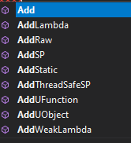

因为`FOnSlottedItemChanged`是一个动态代理，这表示我们可以用blueprint做订阅，下面是装备槽UI Widget中对这个delegate的订阅节点,当装备槽所装备的物品发生实际变动时，更新UI外观
`/Game/Blueprints/WidgetBP/Inventory/WB_EquipmentSlot.WB_EquipmentSlot`

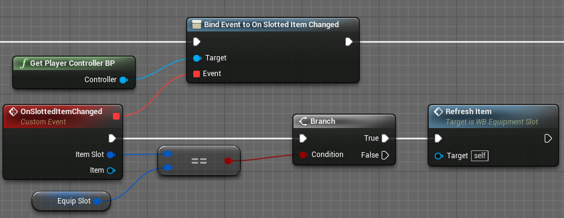


\------------- 步骤4 -------------

经过上面3个步骤，我们相当于连通了所有消息通道，下面当某个delegate发出通知时，所有订阅这个delegate的代码/函数都会被执行

```cpp
// \Source\ActionRPG\Private\RPGPlayerControllerBase.cpp
OnSlottedItemChanged.Broadcast(ItemSlot, Item);
```

## UE中delegate实现

查看一个最简单的delegate声明宏

```cpp
// \Engine\Source\Runtime\Core\Public\Delegates\DelegateCombinations.h
#define DECLARE_DELEGATE_OneParam( DelegateName, Param1Type ) \
    FUNC_DECLARE_DELEGATE( DelegateName, void, Param1Type )

#define FUNC_DECLARE_DELEGATE( DelegateName, ReturnType, ... ) \
    typedef TDelegate<ReturnType(__VA_ARGS__)> DelegateName;
//          ~~~~~~~~~
```
它会拿着我们提供的返回类型，参数...去实例出一个TDelegate类模板（多播是TMulticastDelegate类模板），我们在步骤2中定义的便是这种类型的一个对象。

这些代理类中定义了订阅函数，执行函数等接口，帮我们管理和维护订阅列表。

比如我们每添加一个新订阅时，新函数会被加入对象内部维护的订阅数组`TMulticastDelegateBase::InvocationListType`(`\Engine\Source\Runtime\Core\Public\Delegates\MulticastDelegateBase.h`)，每当代理被执行时，会遍历这个订阅数组并调用其中的函数`TMulticastDelegate::Broadcast(...)`(`\Engine\Source\Runtime\Core\Public\Delegates\DelegateSignatureImpl.inl`)...

几乎所有游戏引擎中都会实现类似的数据结构，有些可能叫事件系统...但目的都是为了用消息的形式解耦代码间的依赖，当然代价也是有的，这会使对游戏流程的分析变得复杂...

TODO UE中事件Logs


## 不同的订阅方法?

前面的步骤3是做订阅，而UE提供了很多可用的订阅函数，如果是动态delegate，还涉及到不同的blueprint订阅方法，下面注释来自UE源码。

不同订阅函数的区别在于针对不同性质的函数，比如全局函数，static函数不需要考虑其绑定的对象；成员函数需要一个其绑定对象的指针；lambda函数在其捕获this指针时也有额外的考虑。

```cpp
// \Engine\Source\Runtime\Core\Public\Delegates\Delegate.h

/*
  ...

 *	Bind function										|	Usage
 *  ------------------------------------------------------------------------------------------------------------------------------------------------------------
 *	BindStatic(&GlobalFunctionName)						|	Call a static function, can either be globally scoped or a class static
 *	BindUObject(UObject, &UClass::Function)				|	Call a UObject class member function via a TWeakObjectPtr, will not be called if object is invalid
 *	BindSP(SharedPtr, &FClass::Function)				|	Call a native class member function via a TWeakPtr, will not be called if shared pointer is invalid
 *	BindThreadSafeSP(SharedPtr, &FClass::Function)		|	Call a native class member function via a TWeakPtr, will not be called if shared pointer is invalid
 *	BindRaw(RawPtr, &FClass::Function)					|	Call a native class member function with no safety checks. You MUST call Unbind or Remove when object dies to avoid crashes!
 *	BindLambda(Lambda)									|	Call a lambda function with no safety checks. You MUST make sure all captures will be safe at a later point to avoid crashes!
 *	BindWeakLambda(UObject, Lambda)						|	Call a lambda function only if UObject is still valid. Captured 'this' will always be valid but any other captures may not be
 *	BindUFunction(UObject, FName("FunctionName"))		|	Usable for both native and dynamic delegates, will call a UFUNCTION with specified name
 *	BindDynamic(UObject, &UClass::FunctionName)			|	Convenience wrapper only available for dynamic delegates, FunctionName must be declared as a UFUNCTION
 *  ------------------------------------------------------------------------------------------------------------------------------------------------------------
 *
 */
```

## delegate宏名自动生成?

https://unreal-garden.com/tutorials/delegates-advanced/#delegate-signature-tool


# 13. UE中的射线检测

TODO

# 14. Action RPG Game中的AI

这篇文章通过Action RPG Game来学习UE中AI的基础内容

Action RPG Game中玩家Character和敌人(NPC, Boss)都继承自BP_Character，这样玩家角色和敌人都可以使用GAS

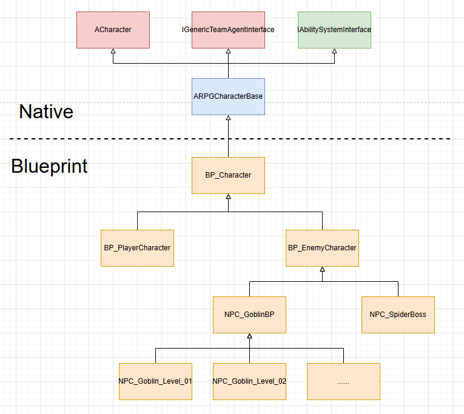

为了让敌人拥有AI能力，首先需要为其指定一个`AIController`，而且一般不种类的敌人使用不同的Controller。使用AI时另外两个重要的组件是`BehaviorTree`和`BlackBoard`

- `AIController`绑定另外两个组件并驱动AI执行
- `BehaviorTree`定义AI的行为决策
- `Blackboard`作为各AI组件共享数据的容器

```cpp
// Player / Game Mode
//        ↓ (Spawn / Possess)
//     Pawn / Character（AI的“身体”）
//        ↑
// AIController（AI的“大脑”）  ← 拥有并控制 Pawn
//    │
//    ├─ RunBehaviorTree()              ← 启动行为树
//    │
//    ├─ UseBlackboard(BlackboardAsset) ← 指定并初始化黑板
//    │
//    └─ BehaviorTreeComponent          ← 运行时组件（自动创建）
//          │
//          └─ 运行 Behavior Tree Asset
//                │
//                ├─ 读取/写入 Blackboard Keys（黑板数据）
//                │     ↑↓
//                └─ BlackboardComponent（运行时黑板实例）
```

下面是Action RPG Game中这三种AI组件的类，分别对应于NPC, BOSS和玩家，因为游戏中有自动战斗模式，所以在这种模式下的玩家角色需要AI驱动。

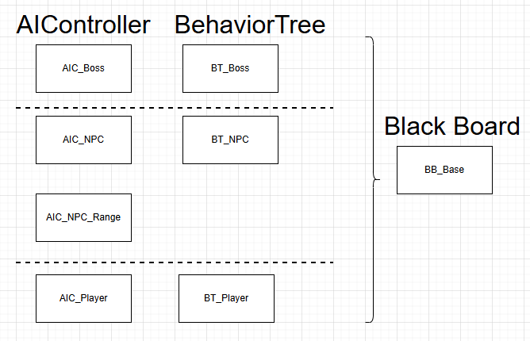

## AIController/AI控制器

`AIController`的一般任务是设置好`BlackBoard`并启动`BehaviorTree`(`/Content/Blueprints/AI/BossAI/AIC_Boss.uasset`)

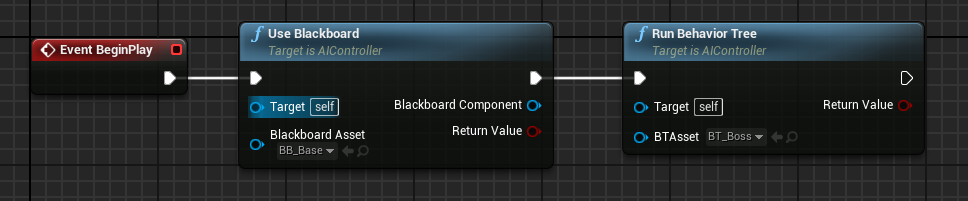

## BlackBoard/黑板

`BlackBoard`中会定义一些类型的变量，这些变量在行为树运行过程中，会被节点设置和读取，从而在不同节点和执行流程中传递状态。

## BehaviorTree/行为树

`BehaviorThree`是AI的核心，它定义了AI应该采取的行为步骤，面对不同情况时的不同反应，同时它又是由许多不同的节点构成

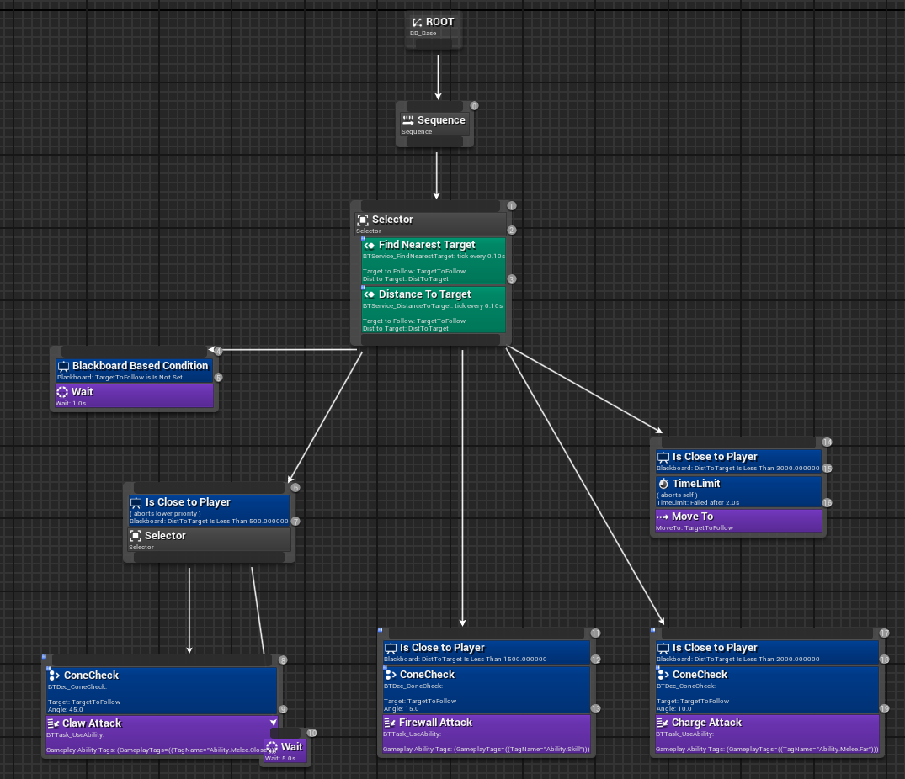

来看看不同节点的含义

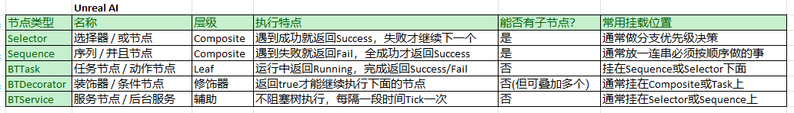

了解了这些节点含义后，我们来拆解`AIC_NPC`中的一些行为`/Content/Blueprints/AI/GruntAI/BT_NPC.uasset`

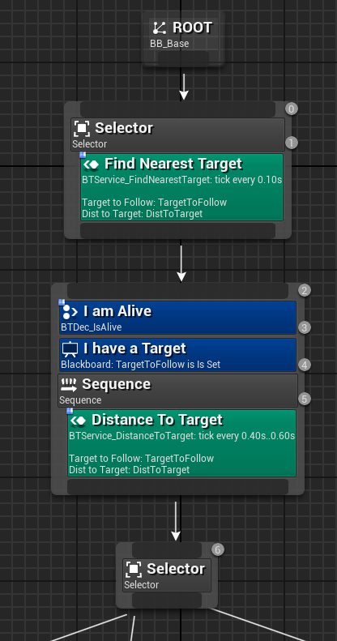

`ROOT`是起始节点，`Selector`节点下有一个`BTService`节点`BTService_FindNearestTarget`，上面的表格已经总结了这种节点的执行特点，我们在其Tick函数中通过ActorTag来查找玩家Actor并将其设置到黑板的`TargetToFollow`变量，方便我们在后面的节点中读取这个变量。

之后是一个`Sequence`节点，这个节点包含两个`BTDecorator`节点，可以把它们理解成继续往下执行的条件，如果条件不满足就不会再执行后面的节点。
- 第一个条件是`BTDec_IsAlive`用来检查自已的生命值是否大于0，否则自己已经死亡，也就不需要执行之后的动作了；

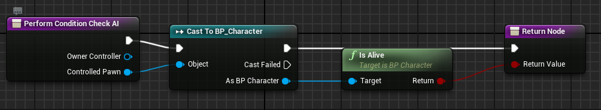

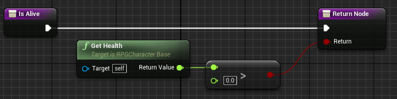

- 第二个条件是一个内置的BlackBoard装饰器，这种装饰器方便我们直接检查黑板中的数据是否被设置，这里检查黑板中的`TargetToFollow`变量，在前面的`BTService_FindNearestTarget`服务中，如果我们找到玩家Actor,我们便会设置这个变量。如果没有，NPC便没有可接近的目标，也就不需要走之后的逻辑。

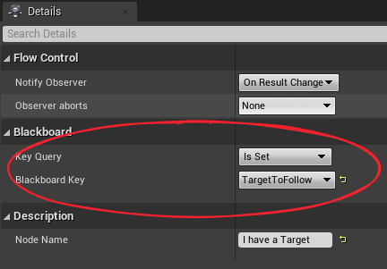

除了两个条件装饰器，这个`Sequence`节点中也包含了一个`BTService`节点`BTService_DistanceToTarget`，在它的Tick函数中，我们计算NPC与目标也就是玩家的距离，并且将结果设置到`DistToTarget`黑板变量，供之后的节点使用。

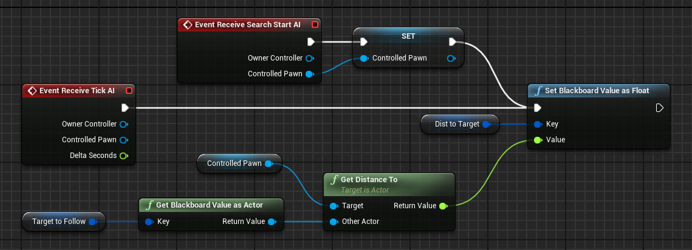

最后是一个`Selector`节点，它下面有3个节点，按`Selector`的执行逻辑，它会依次执行下面的节点，直到有一个成功为止

- 第一个节点树用于在**远程NPC**满足攻击条件时发动攻击
- 第二个节点树用于在近战NPC满足攻击条件时发动攻击
- 第三个节点树为了让NPC达成攻击条件（接近玩家）

下面是第一个节点树的执行内容

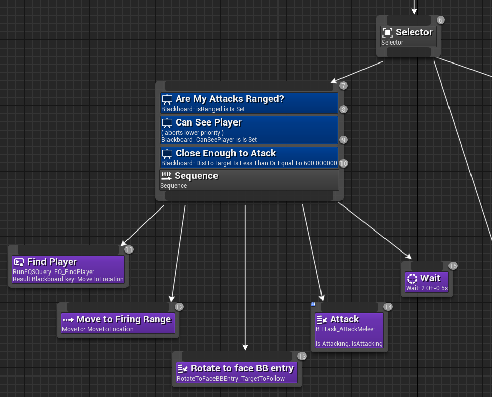

与之前提到的`BTDecorator`类似，这里的三个装饰器分别判断是否是远程NPC、是否能看到玩家（见[AI感知器](#aiperceptionai感知器)）以及是否在攻击范围内。

一旦满足攻击条件，下面的便是采取一系列攻击步骤

- `EQ_FindPlayer`使用EQS（见[EQS/环境查询系统](#eqs环境查询系统)） 在玩家周围寻找一个攻击位置写进黑板的`MoveToLocation`变量
- 使用`Move To` Task移动到这个攻击位置
- 使用`Rotate to Face BBEntry` Task转向玩家
- `BTTask_AttackMelee`是一个自定义Task，它最终会激活NPC的攻击技能
- 使用`Wait` Task等待一小段时间


下面是Action RPG Game中编写的3类行为树节点

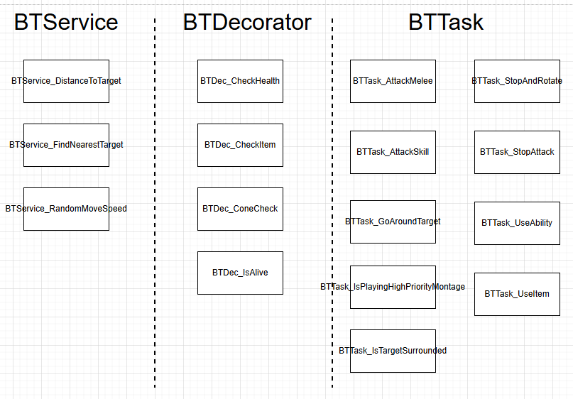


## EQS/环境查询系统

EQS中的一些基本概念

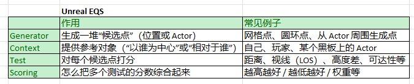

`Environment Query` & `EnvQueryContext`

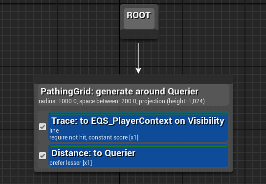

使用EQS找到一些候选位置后，为不同位置打分，得分最高者作为NPC最终要移动到的位置

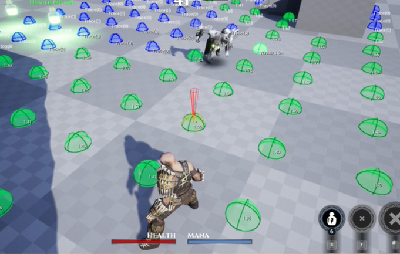


## AIPerception/AI感知

在前面检测NPC是否能看到玩家时，我们使用Blackboard类型的修饰器来检查黑板中的`CanSeePlayer`变量，这个变量设置过程如下
`/Content/Blueprints/AI/GruntAI/AIC_NPC_Range.uasset`

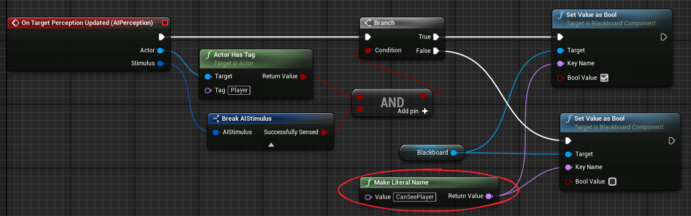

`OnTargetPerceptionUpdated`接口由`AIPerception`组件提供，这是一个视觉感知器，当NPC"看到"玩家时，我们会设置黑板中的`CanSeePlayer`变量

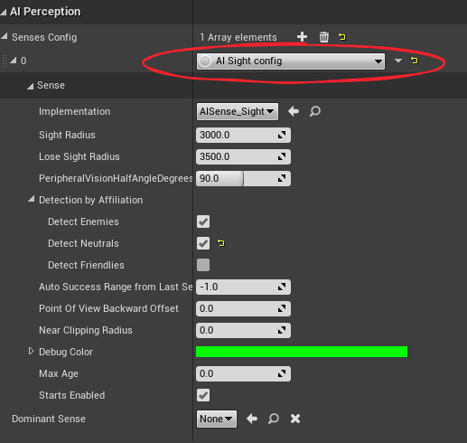

参考[AI Perception](https://dev.epicgames.com/documentation/en-us/unreal-engine/ai-perception-in-unreal-engine)

## AI Debug

见[调试](#)

